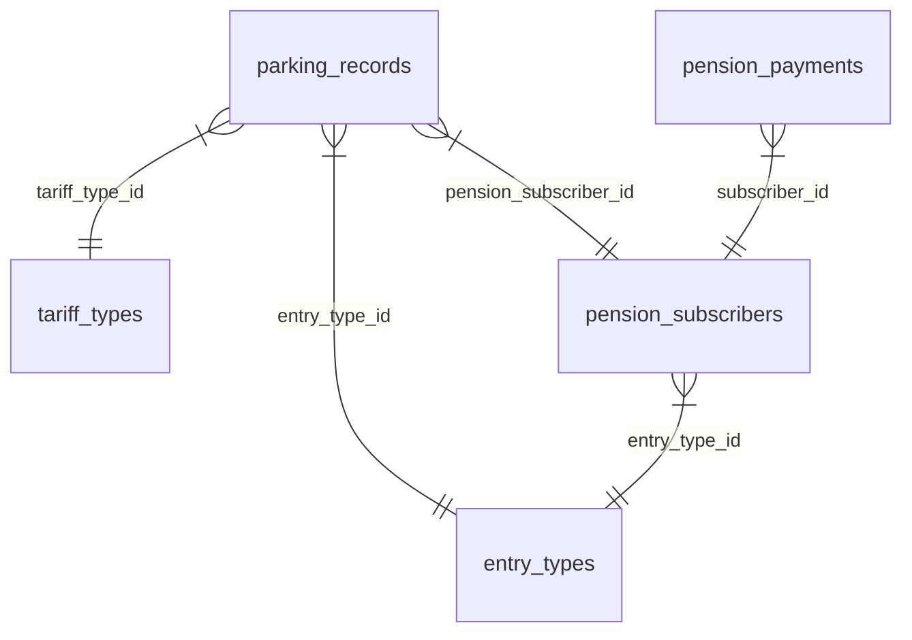

# Diccionario de Datos - Sistema de Estacionamiento

Este documento describe la estructura de la base de datos del sistema, incluyendo tablas, columnas, tipos de datos y relaciones. Su objetivo es mantener la consistencia y servir como referencia para el desarrollo.

**Última actualización:** 2026-01-25

## Diagrama Relacional Simplificado

## Tablas

### 1. `parking_records` (Registros de Estacionamiento)
Almacena cada entrada y salida de vehículos. Es la tabla central del sistema.

| Columna | Tipo | Descripción | Relación / Notas |
| :--- | :--- | :--- | :--- |
| `id` | VARCHAR(36) | Identificador único (UUID) | Primary Key |
| `folio` | INT | Número de folio consecutivo | Generado por secuencia |
| `plate` | VARCHAR(20) | Placa del vehículo | Convertido a mayúsculas |
| `description` | TEXT | Descripción visual (Marca/Color) | |
| `entry_type_id` | VARCHAR(36) | Tipo de vehículo/entrada | FK -> `entry_types.id` |
| `entry_user_id` | VARCHAR(36) | ID del usuario que registró la entrada | FK (Lógica) -> `users.id` |
| `entry_time` | BIGINT | Fecha/Hora de entrada | Timestamp en milisegundos |
| `exit_time` | BIGINT | Fecha/Hora de salida | Timestamp en milisegundos (NULL si sigue dentro) |
| `cost` | DECIMAL(10, 2) | Costo **calculado** del servicio | Basado en tarifa y tiempo |
| `tariff_type_id` | VARCHAR(36) | Tarifa aplicada | FK -> `tariff_types.id` |
| `exit_user_id` | VARCHAR(36) | ID del usuario que registró la salida | FK (Lógica) -> `users.id` |
| `notes` | TEXT | Comentarios adicionales | |
| `is_synced` | TINYINT(1) | Estado de sincronización | 1 = Sincronizado, 0 = Pendiente |
| `pension_subscriber_id` | VARCHAR(36) | ID de suscriptor (si es pensión) | FK -> `pension_subscribers.id` |
| `amount_paid` | DECIMAL(10, 2) | Monto **realmente pagado** | Puede diferir de `cost` (ej. prepago, descuentos) |
| `payment_status` | VARCHAR(20) | Estado del pago | 'PENDING', 'PAID', 'PARTIAL' |
| `created_at` | TIMESTAMP | Fecha de creación del registro | Auto-generado |
| `updated_at` | TIMESTAMP | Fecha de última modificación | Auto-actualizado |

**Nota sobre Importes:**
- **`cost`**: Es el valor que el sistema calcula que *debería* cobrarse.
- **`amount_paid`**: Es el dinero que efectivamente ingresó a caja.
- *Ejemplo*: Si el costo es $50 pero se le hace un descuento y paga $0, `cost`=50, `amount_paid`=0.

---

### 2. `pension_subscribers` (Suscriptores de Pensión)
Almacena la información de los clientes con pensión mensual.

| Columna | Tipo | Descripción | Relación / Notas |
| :--- | :--- | :--- | :--- |
| `id` | VARCHAR(36) | Identificador único (UUID) | Primary Key |
| `folio` | INT | Número de folio de suscriptor | |
| `plate` | VARCHAR(20) | Placa principal | |
| `entry_type_id` | VARCHAR(36) | Tipo de vehículo asociado | FK -> `entry_types.id` |
| `monthly_fee` | DECIMAL(10, 2) | Costo mensual acordado | |
| `name` | VARCHAR(255) | Nombre del cliente | |
| `entry_date` | BIGINT | Fecha de inicio de contrato | Timestamp en milisegundos |
| `paid_until` | BIGINT | Fecha hasta donde está pagado | Timestamp en milisegundos |
| `is_active` | TINYINT(1) | Estado del suscriptor | 1 = Activo, 0 = Inactivo |

---

### 3. `entry_types` (Tipos de Entrada/Vehículo)
Catálogo de tipos de vehículos (ej. Auto, Camioneta, Moto).

| Columna | Tipo | Descripción | Notas |
| :--- | :--- | :--- | :--- |
| `id` | VARCHAR(36) | Identificador único | Primary Key |
| `name` | VARCHAR(255) | Nombre descriptivo | Ej: "PARTICULAR", "UBER" |
| `is_active` | TINYINT(1) | Disponibilidad | |

---

### 4. `tariff_types` (Tipos de Tarifa)
Catálogo de reglas de cobro.

| Columna | Tipo | Descripción | Notas |
| :--- | :--- | :--- | :--- |
| `id` | VARCHAR(36) | Identificador único | Primary Key |
| `name` | VARCHAR(255) | Nombre de la tarifa | Ej: "NORMAL", "NOCTURNA" |

---

### 5. `users` (Usuarios del Sistema)
Operadores y administradores.

| Columna | Tipo | Descripción | Notas |
| :--- | :--- | :--- | :--- |
| `id` | VARCHAR(36) | Identificador único | Primary Key |
| `name` | VARCHAR(255) | Nombre del operador | |
| `role` | VARCHAR(50) | Nivel de permisos | 'ADMIN', 'STAFF' |
| `pin` | VARCHAR(20) | Código de acceso | |

---

### 6. `pension_payments` (Pagos de Pensión)
Historial de pagos realizados por suscriptores.

| Columna | Tipo | Descripción | Relación / Notas |
| :--- | :--- | :--- | :--- |
| `id` | VARCHAR(36) | Identificador único | Primary Key |
| `subscriber_id` | VARCHAR(36) | Suscriptor que paga | FK -> `pension_subscribers.id` |
| `amount` | DECIMAL(10, 2) | Monto pagado | |
| `coverage_start_date` | BIGINT | Inicio del periodo pagado | Timestamp |
| `coverage_end_date` | BIGINT | Fin del periodo pagado | Timestamp |

---

### 7. `expenses` (Gastos)
Registro de salidas de dinero.

| Columna | Tipo | Descripción | Notas |
| :--- | :--- | :--- | :--- |
| `id` | VARCHAR(36) | Identificador único | Primary Key |
| `description` | TEXT | Detalle del gasto | |
| `amount` | DECIMAL(10, 2) | Monto gastado | |
| `category` | VARCHAR(50) | Categoría del gasto | |

## Notas de Normalización

1.  **Eliminación de Redundancia**: Se han eliminado columnas como `client_type` (texto) y `tariff` (texto) de la tabla `parking_records`. Ahora se utilizan exclusivamente `entry_type_id` y `tariff_type_id` para mantener la integridad referencial.
2.  **Foreign Keys**: Se han establecido claves foráneas (Foreign Keys) explícitas en la base de datos para asegurar que no se puedan registrar movimientos con tipos de entrada o tarifas inexistentes.
3.  **Sincronización**: La columna `is_synced` controla el flujo de datos entre la App móvil (SQLite) y el Backend (MySQL).
